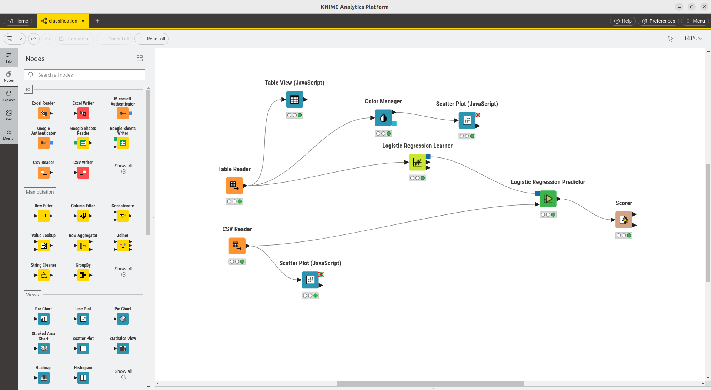
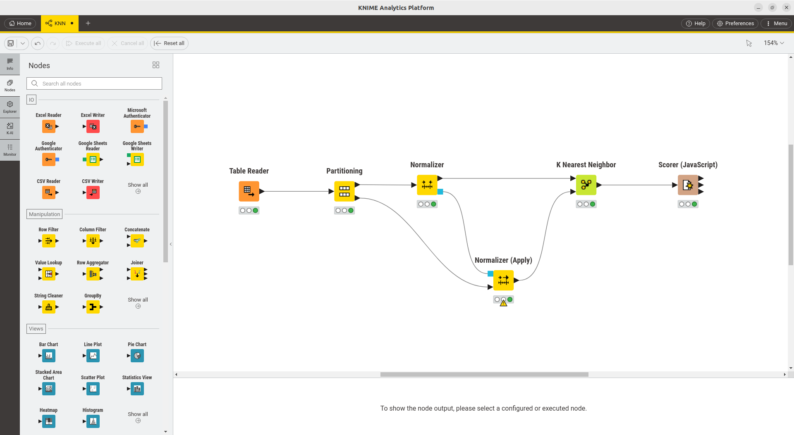

# Machine Learning with Knime Analytics Platform
Using [Knime](https://www.knime.com/) for Machine Learning Applications

## Installation
KNIME is available for free on all platforms: Linux, Windows, and macOS. You can download it by clicking [here](https://www.knime.com/downloads/download-knime?token=1737974123:197.20.72.240:b5048c5b8707a5e8893fc5640ddf5309b4415701e125d1c931670b0dd94050d7/)

## How to Use
1. Download the `.knwf` file from the repository.
2. Open KNIME Analytics Platform.
3. Import the workflow by selecting `File > Import KNIME Workflow`.
4. Browse to the downloaded `.knwf` file and open it.
  
## Plan

1. **Data Preprocessing**
   - Cleaning the data (handling missing values, outliers).
   - Feature scaling (normalization, standardization).
   - Feature selection and extraction.
   
2. **Linear Regression**
   - Building a linear regression model for predicting continuous values.
   - Training the model using the preprocessed data.
   - Evaluating model performance (using metrics like RMSE, R²).

3. **Classification**
   - Implementing classification models to predict categorical outcomes.
   - Evaluating model performance using accuracy, precision, recall, and F1-score.

4. **Clustering**
   - Applying unsupervised learning to group similar data points.
   - Using clustering techniques like K-Means and Hierarchical clustering.

## Sample
### Data Preprocessing

To view the workflow for each node, you should right-click on it and then choose `Open Component`.

### Linear Regression

### Classification

### Clustering

## Acknowledgment

This project was made possible thanks to the resources and tools provided by the [KNIME website](https://www.knime.com/). KNIME Analytics Platform is an invaluable resource for data science and machine learning workflows, enabling users to create, share, and explore data in a visual and intuitive way.

